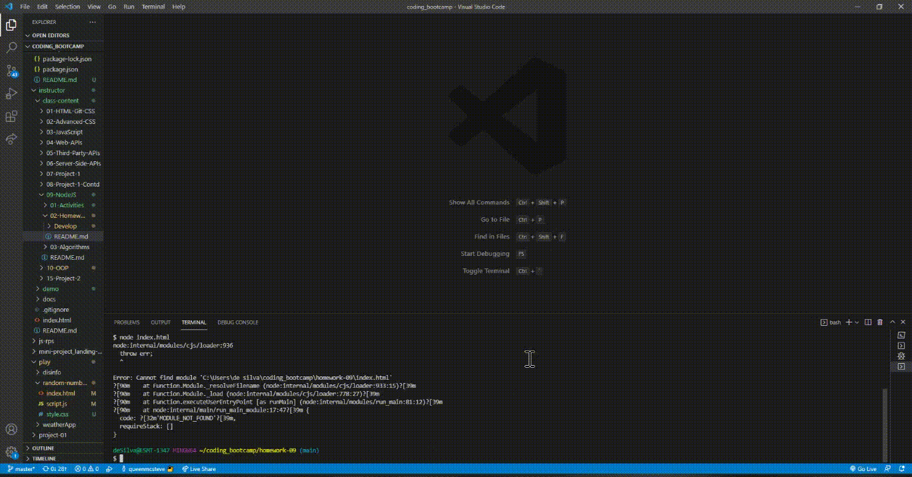

# Readme Generator

## Description:

This is a command line readme file generator, using node.js & inquirer

## Table of contents:

- [Installation](#installation)
- [Usage](#usage)
- [Contributing](#contributing)
- [Tests](#tests)
- [Screenshots](#screenshots)
- [Contact](#contact)
- [License](#license)

# Installation Instructions

Install npm/inquirer prior to running `node index.js` from command line.

# Usage

Feel free to use it however you please.

# Contributing

You're welcome to fork and clone the repo.

# Tests

There are no tests currently available for this app.

# Screenshots

As this is a command line program, there are no screenshots. Please watch the following demo video to see the program in action.

[Demonstration Video](https://watch.screencastify.com/v/4C4WWdbCz0kG146IEwkr)

# Contact

If you have any questions you can reach me via:

- Github: [queenmcstevee](https://github.com/queenmcstevee)
- Email: [queen.mcsteve.666@gmail.com](mailto:queen.mcsteve.666@gmail.com)

# License

[MIT](https://opensource.org/licenses/MIT)
